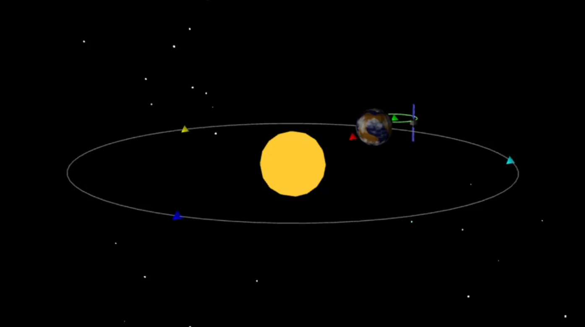

# Modélisation 3d avec webGL du telescope James-Webb

## Lancer le projet.

installer un serveur live sur votre editeur (vscode) et ouvrer le fichier html avec.

## Principe clean code

Certaine fonctions du projets ne sont pas remplit car elle ne fesait pas parti des principes de code Qualité.
L'injections de dépendance est ici privilégier.

Mais le projet est belle est bien mené a ca fin.

## Sujet

voir le pdf dans archive.
